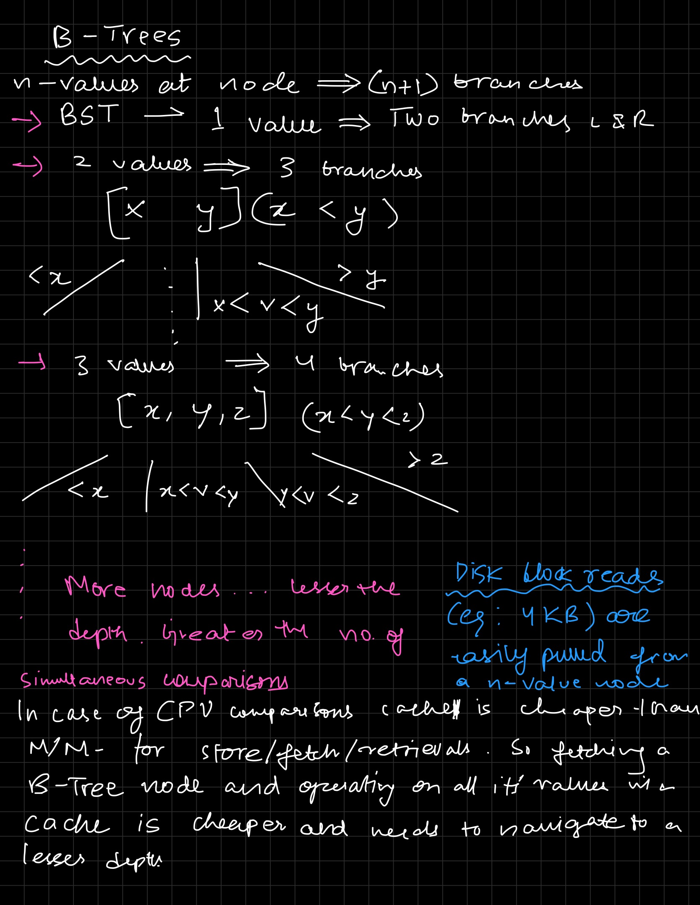
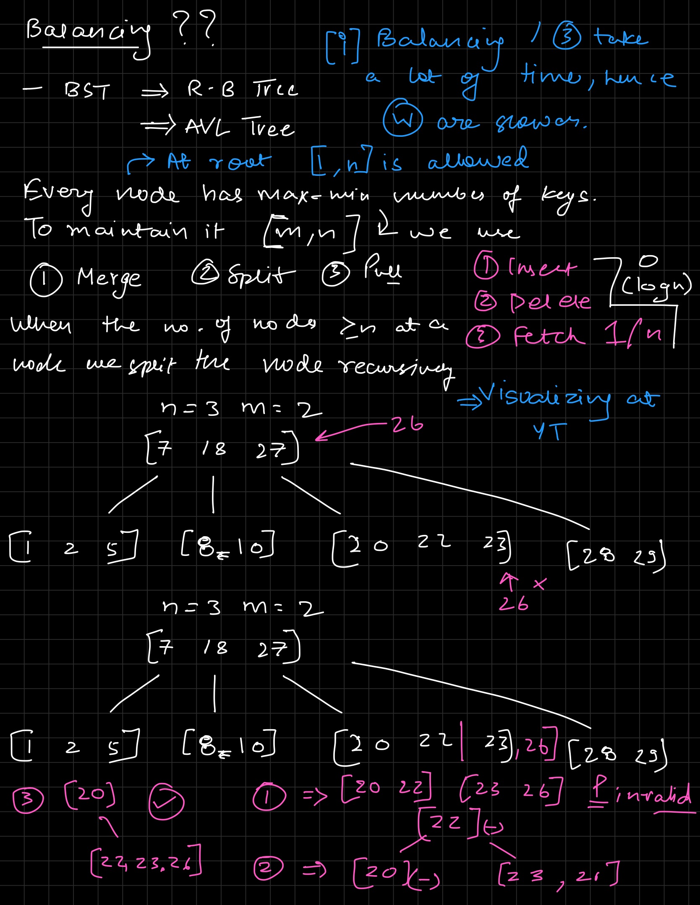
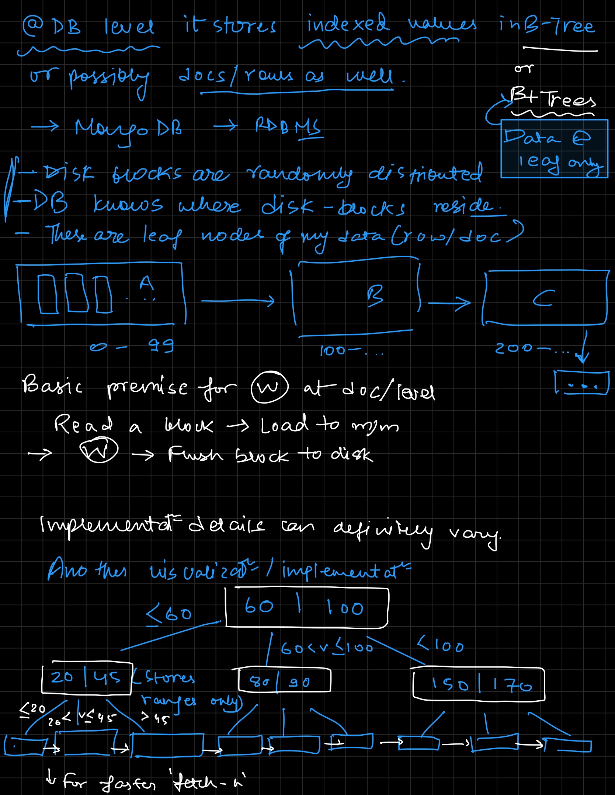
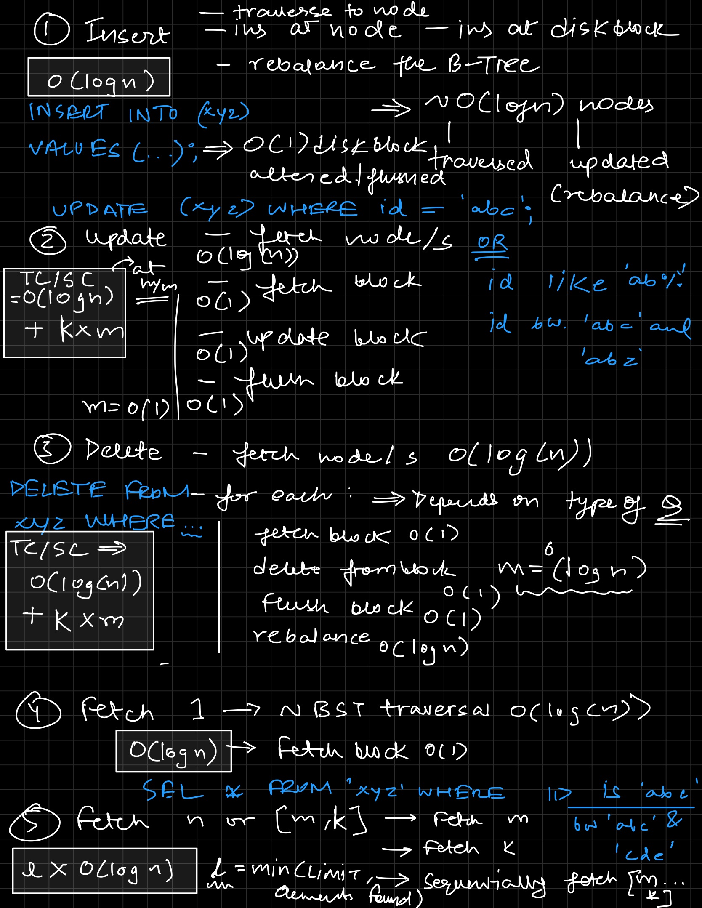

### A small B-Tree overview

(Visualization)[https://www.youtube.com/watch?v=K1a2Bk8NrYQ]

**Diff bw B-Tree and B+ Tree**?? B+ Tree is a type of B-Tree where all values are stored at the leaf level. In a B-Tree, values can be stored at any level. This means that in a B+ Tree, all leaf nodes are linked together, allowing for efficient range queries. In a B-Tree, this is not necessarily the case.