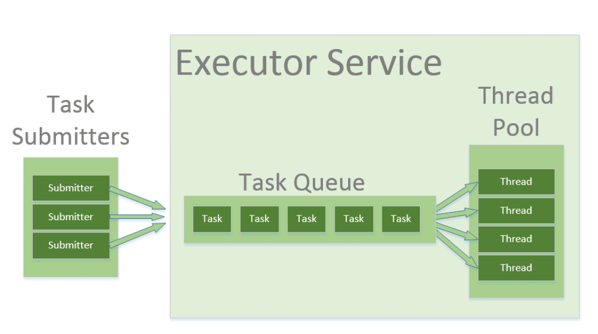

# Thread Pools & Executors



- Very common
- Used to manage a pool of threads and through it OS resources, particularly M/M in practical terms

```java
import java.util.concurrent.Executor;
import java.util.concurrent.ExecutorService;
import java.util.concurrent.Executors;

@Autowired
public class MyService {
  private final Executor executor;

  public MyService(ExecutorService executor) {
    this.executor = executor;
  }

  public MyService() {
//    this.executor = Executors.newSingleThreadExecutor(); // Example: create a single-threaded executor
    this.executor = Executors.newFixedThreadPool(10); // Example: create a thread pool with 10 threads
  }

  public void executeTask(Runnable task) {
    executor.execute(task);
  }
  
  public void printstuff() {
    executor.execute(() -> {
      System.out.println("Hello from thread: " + Thread.currentThread().getName());
    });
  }
}
```

### Thread Pools with blocking calls

```java
ExecutorService executor = Executors.newFixedThreadPool(10);
Future<String> f = executor.submit(() -> {
  // Do some work
  return "Result";
});
String result = f.get(); // Blocking call
```

### ScheduledThreadPoolExecutor

```java
ScheduledExecutorService executor = Executors.newScheduledThreadPool(10);

// Schedule a task to run after a delay
executor.schedule(() -> {
  // Do some work
}, 1, TimeUnit.SECONDS);

// Schedule a task to run periodically
executor.scheduleAtFixedRate(() -> {
  // Do some work
}, 1, 1, TimeUnit.SECONDS);

l
```