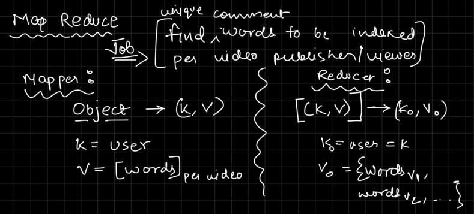
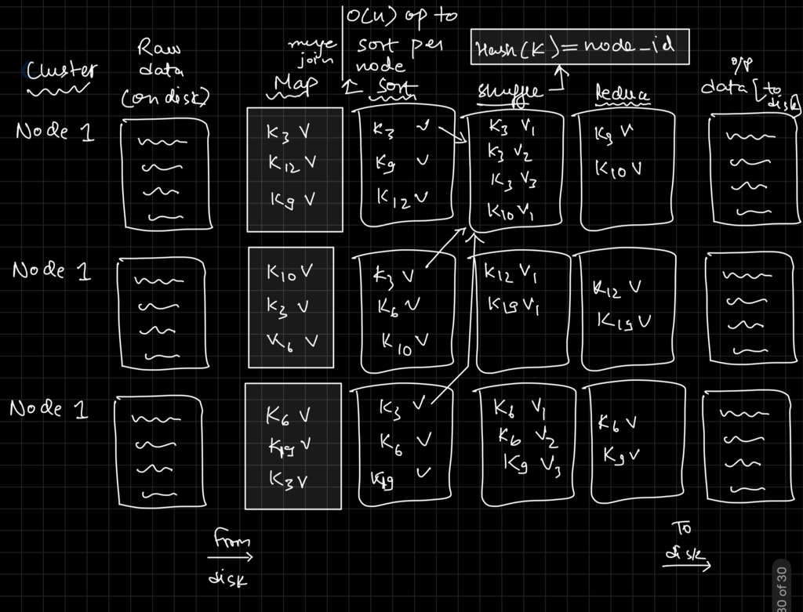
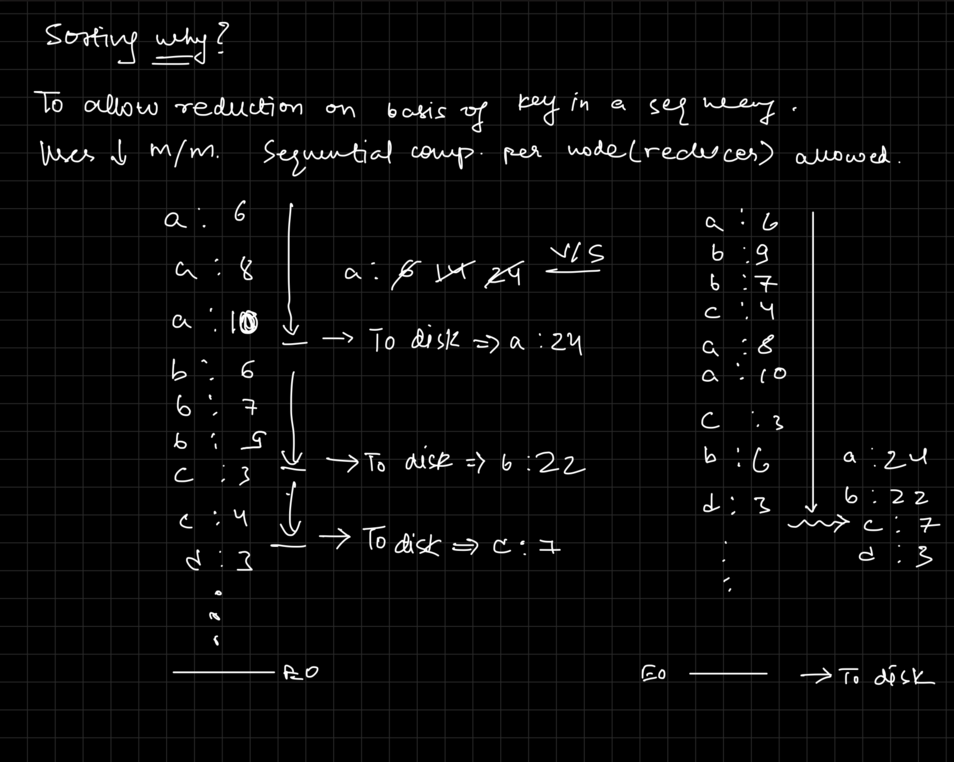
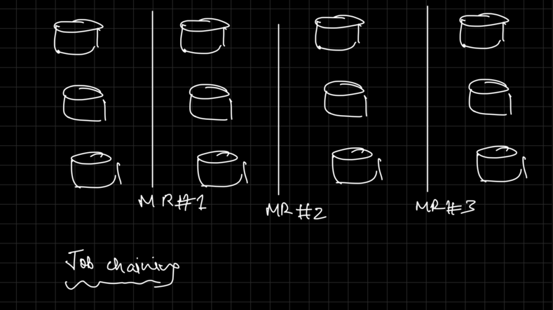

# Map-Reduce jobs

It's a batch processing framework, which can process data in parallel.

### Map-Reduce jobs basic premise

Mapper is responsible for processing input data and emitting key-value pairs. Please note, since each node can process a chunk of random data, it's possible it processes the data for a key(for let's say value V_a), another node might process the data for the same key(for value V_b). This is why the output of the mapper is sorted and shuffled before it's sent to the reducer.

Reducer is responsible for processing the output of the mapper. The output of the reducer is the final output of the job in form of a key-value pair. Each reducer is responsible for processing a subset of the keys, in sorted order.

Shuffling is essentially hashing the key and sending it to the correct reducer.

Sorting is done for keys at each mapper node to allow performing a merge sort on the output before sending it to the reducer. After shuffling, the keys are sorted at the reducer node.

### Why sorting is done?

Sorting at shuffling layer is done to allow for a merge sort at the reducer node. This is done to allow for a more efficient processing of the data. 

If the data is not sorted at reducer node, we would have to keep track of all the keys and values for a key in memory before it can start processing the data. This is not efficient and can lead to out of memory errors. So sorting allows each node to process the data for a key and flushes the data to disk before it can start processing the next key.

### Map-Reduce chaining jobs

Multiple Map-Reduce jobs can be chained together. The output of the first job is the input of the second job and so on. This is done in form of disk files written to HDFS.